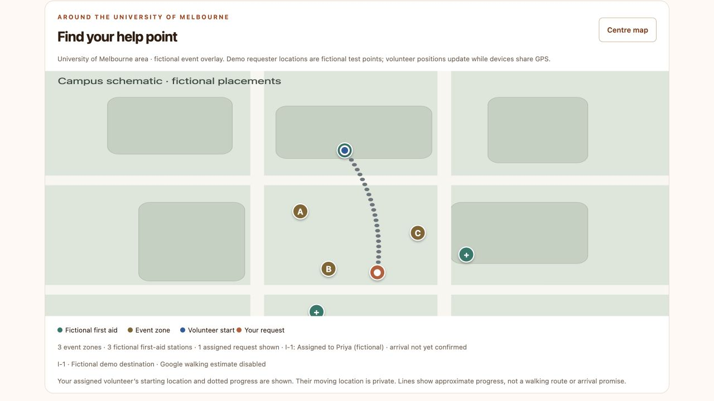

# Attendee assignment visibility — 8 October 2026

The reported flow was: attendee chooses **Use demo location**, sends a report without requesting assistance, Mo offers a volunteer, and the volunteer accepts.

## Findings and changes

- Reproduced that exact flow in the isolated judge demo with a new fictional report and separate attendee/Mo/Priya tabs. After Priya accepted, the original attendee automatically saw the responder name, starting circle, request circle and grey dotted Bezier path. Fake movement was never started. No assignment-permission failure was reproduced.
- The previous attendee tunnel shown in the browser was expired: the browser displayed **Failed to fetch** and an independent HTTP request could not resolve the hostname. The current tunnel returned HTTP 200 and its browser page loaded the actual Google basemap and sample pins. Temporary tunnel origins change; all participants need the same current link. Guest report ownership remains scoped to the original browser cookie and origin.
- The map summary now explicitly names the assigned responder. Google Maps fits the complete curve, including a distant saved starting ping, on a new assignment or changed endpoints. Progress updates preserve the user's chosen viewport; Centre map fits the active path again. A simulated Google adapter verifies those bounds and behavior.
- A visible connection warning replaces raw fetch errors, explains that updates are paused, and retries automatically while preserving form text. Disconnection removes stale map tracking. Stopping the disposable server verified the warning and hidden map in the browser. Automated checks cover successful recovery and an older failed request arriving after a newer successful refresh.
- Named-zone reports remain approximate reference points, without an invented GPS journey. Public attendees still receive only their own assignment and frozen starting ping, not moving volunteer positions.

## Verification

**181/181 automated tests passed** in the workspace and again in a fresh extraction of the updated ZIP, no failures or skips, using isolated stores and simulated providers/GPS. The extraction inherited only PATH; no private configuration, saved app data or dependency installation was needed. New server integration coverage uses the exact report-only demo-location/manual-offer flow and checks unrelated guest isolation. API/map tests check connection loss/recovery, request races, assignment labels and full-curve viewport bounds.

The screenshot uses the labelled keyless campus schematic and simulated volunteer GPS. Physical iPhone/Safari reproduction, physical GPS and actual Google viewport fitting for a distant responder remain unverified. The real Google basemap was checked read-only, without submitting a live report. No live AI/Routes calls, purchases, real-store changes, account resets or real-app restart were performed.
