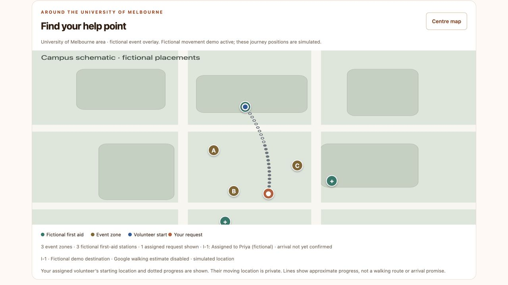

# Public judge demo Quick Tunnel — 8 October 2026

User requested a shareable HTTPS link for the keyless judge demo. Added `npm run demo:tunnel`; [instructions](../../JUDGES.md#share-the-demo-by-https-quick-tunnel) cover official cloudflared installation, startup, accounts, stopping, alternate ports and temporary-link behavior.

## Measured checks

- Started the launcher with the workspace's previously verified official Cloudflare binary. It printed a real `trycloudflare.com` origin; HTTPS session checks returned 200, Secure/HttpOnly cookies, disabled browser account setup, polling and simulated-provider status. Private configuration/store/Git routes returned 404.
- Browser walkthrough at that HTTPS origin: attendee submitted a fictional **Use demo location** report; Mo clicked its actual map pin, offered Priya; Priya signed in, went available and accepted. Attendee automatically saw responder name and dotted path. Mo started simulated movement; grey/white paths rendered in all three views and the attendee retained only the starting marker, not moving volunteer coordinates. A zone pin opened its details and selection control.
- Browser checks caught that the schematic adapter needed to accept the current Google PinElement content and `addEventListener('gmp-click')` interface. Corrected both and added a compatibility regression test; no Google request is needed for this schematic.
- Cleared only the new sandbox's fictional walkthrough report through Mo's typed-CLEAR control, leaving a clean demonstration. Sandbox accounts/settings remain. Normal app reports, accounts, provider approvals/counters, port 8765 and its existing tunnel were not modified or restarted.
- **190/190 automated tests passed**, no failures or skips, with isolated data and simulated providers/GPS. New coverage checks public host/origin restrictions, secure cookies, setup prohibition, assets/private-file boundaries, report → manual offer → acceptance and guest isolation; URL parsing, missing client/exit/timeout/cancellation errors; and current marker adapter compatibility.

## Boundaries

This launcher explicitly publishes the fictional sandbox with its displayed demo passwords. Anyone with the link can use Mo's demo controls. `.env` is not loaded; no live AI, Google Maps, Google Routes or real GPS calls are made. Demo data is isolated in `.riverside/judge-tunnel` and the app listens only on loopback, behind the exact public HTTPS host. Quick Tunnels use six-second polling rather than server-sent events.

Cloudflare provides a temporary hostname, not permanent hosting or an uptime guarantee. Keep the host awake, online and the launcher running; Ctrl+C stops both processes and a new launch gets a new hostname. Different origins have separate attendee cookies/history. The current origin/status and diagnostics are saved privately in `.riverside/judge-tunnel-access.json` and `.riverside/judge-tunnel.log`, not in the judge archive.

Physical phone/Safari, Windows/Linux cloudflared installation and actual GPS remain unverified. The latest full suite was run in the workspace; earlier fresh-extraction checks are recorded separately in [submission readiness](SUBMISSION-READINESS.md).
